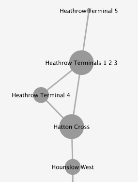
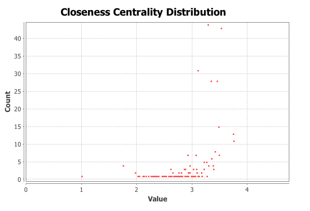
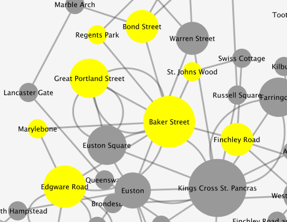
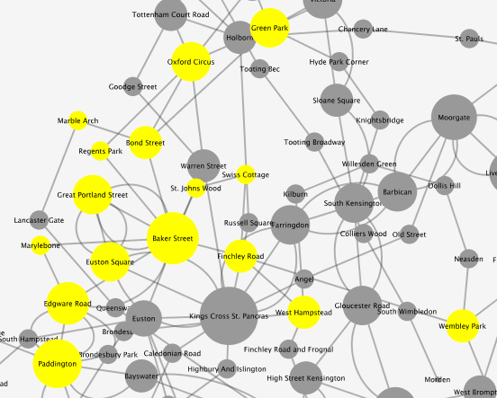
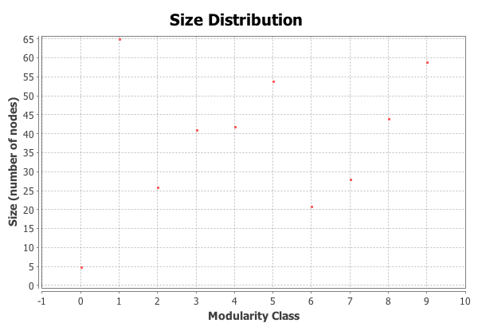

The graph I will be analysing represents the London Underground Tube System as a network containing nodes (stations) and links (lines). The network is made up of 358 nodes based across 13 different lines. Nodes with more stronger connections in the graph are represented more largely than nodes with less connections.

This graph (above) features the topology of the London Underground Tube Network. The graph based on the London Underground Tube System shows 13 lines that make up the network (Bakerloo, Central, Circle, District, DLR, Hammersmith & City, Jubilee, Metropolitan, Northern, Overground, Piccadilly, Victoria and Waterloo & City). Not geographical like the tourist version of the map.

A key characteristic of the graph is that no nodes are disjoint; the entire graph is a connected component. This is integral for an integrated public transport system like the London Underground and is the way the system was designed; to avoid redundant connections.

This total connectivity allows passengers to change at stations (nodes) that connect to different lines (paths). These nodes that are between lines have a betweenness centrality (b.c) of more than 1. Popular nodes in this network are those nodes with high b.c.

Kings Cross St. Pancras station and its 8 first neighbours, of which it is in between all of them. Giving King’s Cross a betweenness centrality score of 8, the largest in the graph.

Measuring betweenness centrality to measure “importance” of nodes is only appropriate in the specific context of the London Underground. As, for example Heathrow Terminal 5 has a b.c of 0 as it doesn’t fall between any 2 stations. Though this station is an important interchange between the London Underground network and global air transport.

Heathrow Terminal 5 (top) is at the end of the Piccadilly line on the London Underground network, and isn’t between any stations; making its betweenness centrality 0

Passengers on the London Underground typically want to get from A to B as quickly as possible, identifying the shortest path between A and B. The average path length in the network is 3, which tells us the average number of steps along shortest paths for all possible connected nodes in the network. Another measure that is important for moving around the network quickly is the closeness centrality distribution. Closeness in the network tells us the average distance from a given starting node to all other nodes in the network.

Closeness Centrality Distribution across the London Underground network.

A characteristic of some of the larger nodes in the network (higher centrality) are that they are connected to other nodes with a b.c of more than 1. If we look at Baker Street, that has b.c of 7, then if we look at the extended neighbour set of Baker Street we see a total b.c of 15.

Baker Street node and its first neighbour set (7).

Baker Street and its neighbour set to 2-degrees (15).

Running a test in Gephi for modularity tells us that the network is made up of 10 communities; with a modularity of 0.457. Because the networks modularity is positive, this tells us that the number of edges inside the group are more than the expected number.

Size distribution of communities across the London Underground network.

The average degree of the network is 3.7. This tells us the network is more connected and is good news for passengers meaning you need to take an average of 4 stops on the network to reach a station with interchange to another line.

Degree distribution across the London Underground network.

The way that the London Underground Tube network was designed means that in some places, nodes (stations) are connected by more than one path (tube line). The graph has fixed rules; you must follow the links between the nodes to travel between stations. It is interesting to measure the importance of some nodes in the network compared with others and this type of metric might be useful to passengers for how to travel across the network quickly. Some communities are visible in the network, and nodes in those communities share characteristics (high betweenness). The entire graph is connected and could be seen as a large community, though it is more efficient to divide the graph into communities because it is more likely you will be travelling in less than all 10 communities inside the graph.