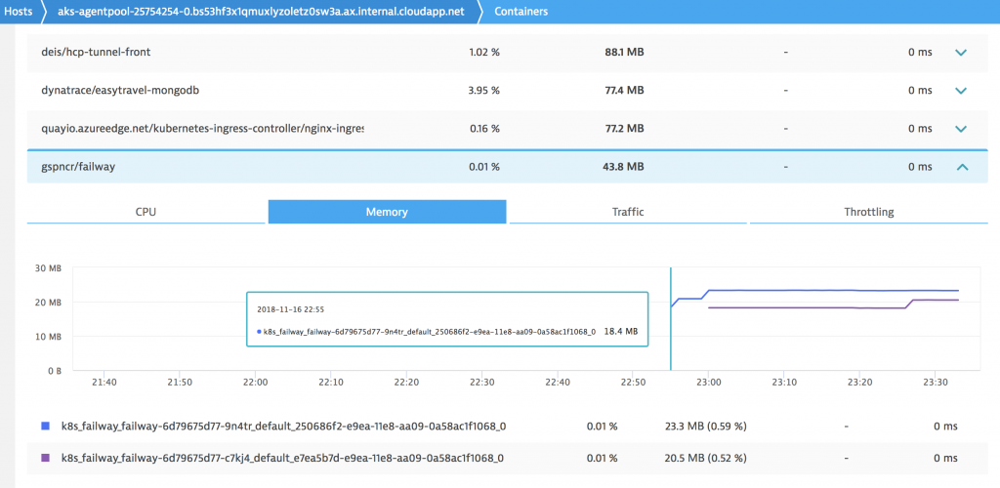
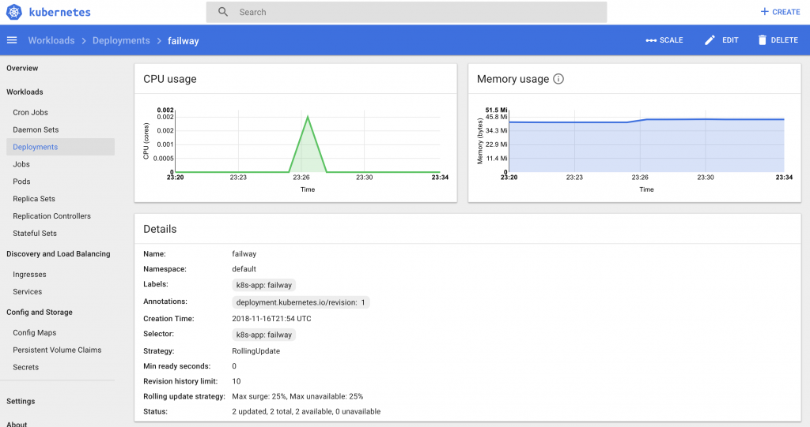

At last I worked on dockerising the Failway Project. I have also released the [source code on Github](https://github.com/gspncr/failway) and published the [image on DockerHub](https://hub.docker.com/r/gspncr/failway/)!

I started the Failway project a while ago and there is still more to come. The changes here are minor on software, and all about deployment ease. The only software switch was no longer using Flask Logging but [Python’s native Logging library](https://docs.python.org/3/library/logging.html) which made life easier than using Flask for that.

# Source code
As I pointed out the source code is on GitHub. It is still not in a tidy state, but useable. Logging is rewritten so the app can run seamlessly. I am going to change the logging again in favour of a logging stream so I can ingest this easier in Kubernetes, I will publish this as a separate branch.

The station path is still one way. I think the most portable way to address it is to set the from and to stations using environment variables. I am still yet to build this for an entire route or give the ability to choose in the interface which is my next step.

The logging also appears very nicely in Dynatrace as you can see above. FYI, those logs discovered automatically, and agent injection automatically handled with the OneAgent operator in Kubernetes.

# Docker image
I published a pre built image to Docker Hub at gspncr/failway which includes the route from West Hampstead Thameslink to Luton Airport Parkway (my old commute before I moved).

The Dockerfile is published to Github too. The Dockerfile works in the /app/ directory and works by copying the raw files from Failway on Github into the /app/ directory. It also installs the Python dependencies using pip. It is exposed on port 80.

# Kubernetes
The best way to run this (and almost anything else) is using Kubernetes. The main reason in my case is National Rail’s frequent banning of the calling IP and the ban lasts for 60 minutes at a time. By having a good enough ReplicaSet and number of pods this can be avoided.

I am working on (immediate next task) a Kubernetes yaml file, and I want to include a health endpoint to check for when the k8s node is banned by NR and to remove it from handling traffic (user will see a HTTP 500 (now also handled)).

# Future
I want to evaluate IaaS providers container services. In Kubernetes the node IP address will not change so frequently. A nice/lazy workaround is to have a pool of at least two container services hosting Failway, and introduce a load balancer ahead of the downstream container services, and when the containers have their individual IPs banned by National Rail are destroyed and returned to the pool with a new IP address. This means less downtime because of the IP situation. Of course in an ideal world I rework the batch job script which was the first design of Failway and keep a cache up to date. I will look at it again but it had two main problems, first that the results are quickly out of date, the second is it is expensive to keep the cache up to date; but having that cache would avoid the IPs being banned but the tradeoff is not accurate results from National Rail.