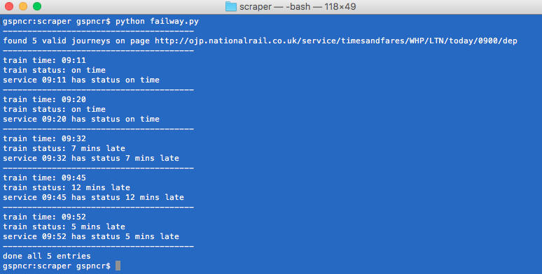
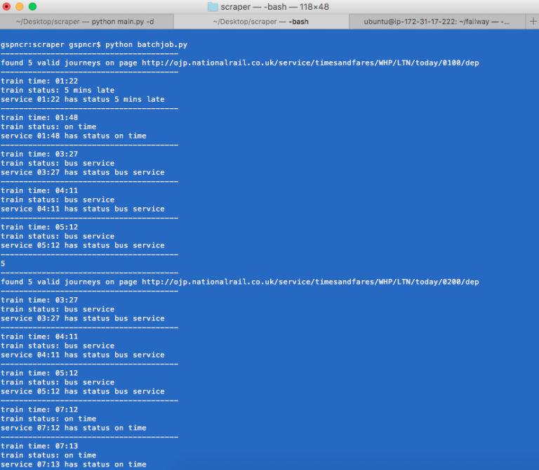
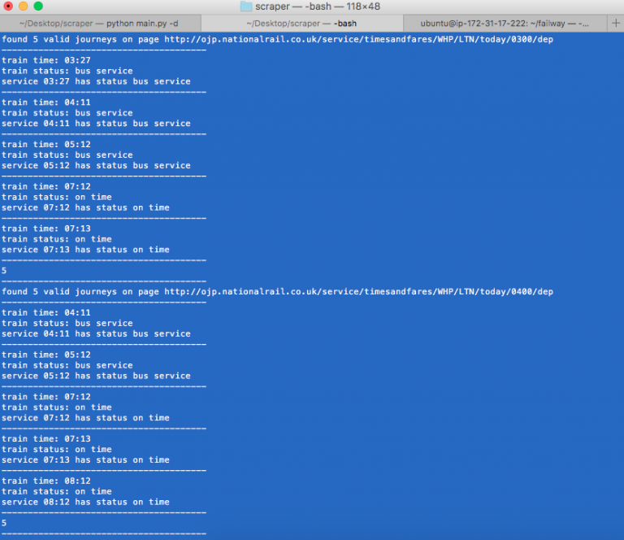
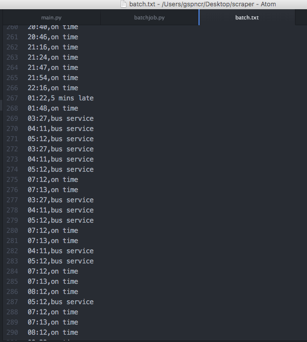
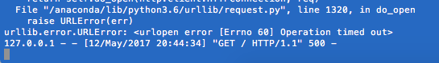
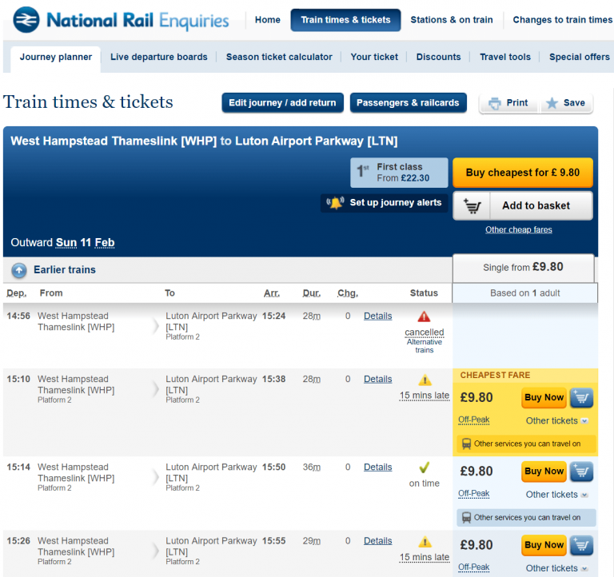

We started using Microsoft Teams at work. A friend that works at Microsoft told me a cool way to access MS Teams, using http://slack.fail which I liked a lot. I have nothing against Slack and nothing for Microsoft, but it made me think, what else in my life is a fail.

“We are sorry to announce the 17:29 service is delayed by 17 minutes”

The apple hit my head – trains are pretty rubbish. “Delay Repay” I hear someone mention. Yes, what a horrible process that is – and having to remember to do it, etc, etc.

So I made a small thing that checks train services each hour on the Thameslink and the status of the train. In the current few versions, only the route West Hampstead (WHP) through to Luton Airport Parkway (LTN) will be checked; my commute.

I am working on http://thameslink.fail to have the delays each day sorted. In both directions. I will get this up on GitHub pretty soon. It is written in Python and makes use of BeautifulSoup4 and urllib packages. My plan is for it to save these for the last 30 days or so, showing delays greater than 15 minutes and maybe I can do something smart as an extension to automate the Delay Repay claims process. Stay tuned 😏


The performance monitoring train has no brakes

## v0.2 – in the web!

thameslink.fail is now live on the web in v0.2.

In version 0.2 only the current hour will be live and there is no caching happening (requests you make are performed, live, from the server.

## New Features in the client side version:
### Day Overview
You can query the current days 24 hour performance for Thameslink. There is some tidying to be done in the styling, but you can fetch the days entire timetable and train performance. Sometimes NR return journeys which might feature in a different hour set to show journeys around the time a user wishes to travel – there is some work to be done in avoiding these repetitions. Hopefully this will come when post-processing comes in v0.5ish.

 

### Writing to a text file
The output is a comma separated value list for the days timetable with status, per line. There is work to be done on formatting when there is a cancelled service since NR use some separate styling on the page here. The benefit of this running as a “batch” process is it would only really need to be ran at the minimum once per day to have the current days context. Once database storage comes in this would probably run once per hour to keep its collection up to date. I would likely keep the batch job as some service in the background, fetching the previous days delays. An idea came to mind that for delays greater than 15 minutes a summary could be sent to a user on this.


## The National Rail ban hammer has decided //project update
How’s the project going?

Yeah, National Rail keep banning my IP. Probably expected. This really is only a set back in the testing since the live scraper would not run the route too often (worse case scenario report on previous day, meaning just 1 scan). I am thinking up some ideas. Ideally I don’t want to impose the end user running the scan (was my previous idea in nodeJS/Angular). Since then I could not achieve the alerting feature.

This also means I can no longer check trains from my WiFi – nor my flatmate!! 😱

## Project Update
The worker process can be more efficient by taking a poll once an hour, and keeping a cache of it. Basically, in the background you will have the “batch job” running for the route, and for the hour. The live site will read from this cache (v0.3), the latest. To prevent it being stale – such as, a train in motion which has been delayed from departure to arrival – a timer is implemented to take a poll at an interval preventing the rate limit from being hit (v0.4); in a worst case, that a problem has caused a rate limit and NR return 403 you can destroy this instance and spin a new instance in any container environment supplying a new IP to ovecome – this is not yet scoped since decoupling the processes is a pre-requisite (part of v0.3).
 Q[](failweb.png)

### Data… data everywhere!

You can take the source code for the main worker process (running thameslink.fail) and the batch job worker process from my Azure Notebook [here](https://notebooks.azure.com/gspncr/libraries/failway). I have commented the code best as possible and will update new releases there!

```shell
tmux
python3 main.py
tmux detach
```
I am hosting on an AWS t2.nano in eu west 2b and costs under $5 per month. It is free tier eligible. I am using Route 53 for hosting the DNS and domain registration.
