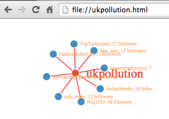
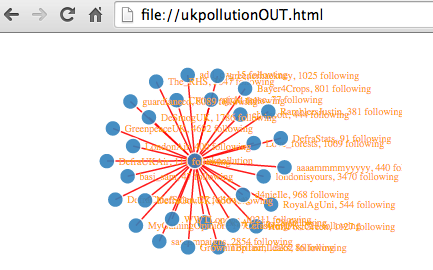
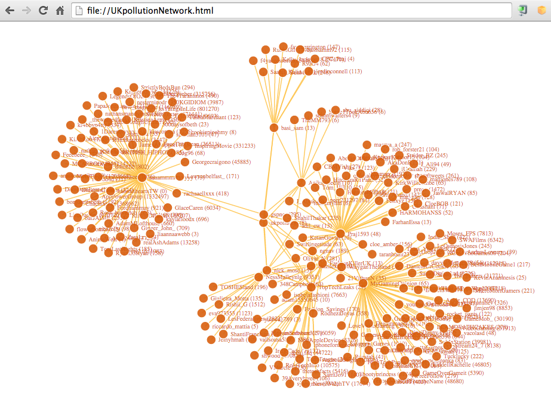
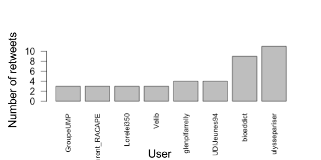
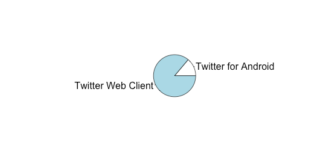

Twitter is a network made up of people you follow and people who follow you. These networks follow traits of other networks and analysing them can help identify important players in the network and characteristics the network has. This post will look at investigating a Twitter profile you have access to and visualising this using R.

# Setting Up

Each of the code snippets require this setup code below. This installs the packages required and adds them to the project. It also takes care of setting up authentication with Twitter. I have been using a test account I created @ukpollution, so wherever you see ukpollution ensure you change this to your personal Twitter handle. You will also need to have at hand your [Twitter API details](https://apps.twitter.com/app/new).

```python
install.packages("​twitteR​")
install.packages("​ROAuth​")
install.packages("​RCurl​")
install.packages("​httr​")
install.packages("​devtools​")
install.packages("​tm​")
install.packages("​wordcloud​")
install_github("​christophergandrud/d3Network​")
library(​twitteR​)
library(​ROAuth​)
library(​RCurl​)
library(​httr​)
library(​devtools​)
library(​tm​)
library(​wordcloud​)
library(​d3Network​)
accessToken<-"Twitter API Access Token​"
accessSecret<-"​Twitter API Secret Key​"
consumerKey<-"​Twitter API Consumer Key​"
consumerSecret<-"​Twitter API Consumer Secret"
setup_twitter_oauth(​consumerKey​,​consumerSecret​,​accessToken​,​accessSecret​)
```

# Mapping your followers
This script maps the followers of your account along with the number of accounts each is following and being followed by. This R code produces a network of 1 degree, those following @UKPollution.

```python
user​<-getUser(​'ukpollution'​)
str(​user​)
followers​<-​user$getFollowers()
screen.name​<-sapply(​followers​,function(​x​)​x$getScreenName()​)
followers.count​<-sapply(​followers​,function(​x​)​x$getFollowersCount()​)
data​<-data.frame(​screen.name​=​screen.name​,​followers.count​=​followers.count​)
rownames(​data​)<-​NULL data$name.count​<-paste(​data$screen.name​,"​,​",​data$followers.count​,"​followers​",sep="")
data​<-​data.frame​(source="​ukpollution​",target=​data$name.count​)
setwd("​/​")
d3SimpleNetwork( ​
  data​,
  width=​300​,
  height=​200​,
  textColour="​orange​",
  linkColour="​red​",
  opacity=​0.9​,
  fontsize=​10​,
  file="​ukpollution.html​")
```

The output will look like the following:


# Mapping those accounts that you follow
This R code produces a network of 1 degree ­ accounts @UKPollution is following.

```python
user​<-getUser(​'ukpollution'​)
str(​user​)
following​<-​user$getFriends()
screen.name​<-sapply(​following​,function(​x​)​x$getScreenName()​)
following.count​<-sapply(​following​,function(​x​)​x$getFriendsCount()​)
data​<-data.frame(​screen.name​=​screen.name​,​following.count​=​following.count​)
rownames(​data​)<-​NULL data$name.count​<-paste(​data$screen.name​,"​,​",​data$following.count​,"​following​",sep="")
data​<-​data.frame​(source="​ukpollution​",target=​data$name.count​)
setwd("​/​")
d3SimpleNetwork( ​
  data​,
  width=​400​,
  height=​250​,
  textColour="​orange​",
  linkColour="​red​",
  opacity=​0.9​,
  fontsize=​10​,
  file="​ukpollutionOUT.html​")
```

The output will look like the following:


# Mapping your followers’ followers
This script crawls through followers of @ukpollution and those followers’ followers to build a total network graph for @ukpollution.

```python
user​<-getUser(​'ukpollution'​)
str(​user​)
followers​<-​user$getFollowers()
screen.name​<-sapply(​followers​,function(​x​)​x$getScreenName()​)
followers.count​<-sapply(​followers​,function(​x​)​x$getFollowersCount()​)
data​<-​NULL
for(​name​in​screen.name​){
  ​user.tmp​<-getUser(​name​) ​name.tmp​<-paste(​name​,"​(​",​user.tmp$getFollowersCount()​,"​)​",sep="") ​
  followers.tmp​<-​user.tmp$getFollowers()
  ​screen.name.tmp​<-sapply(​followers.tmp​,function(​x​)​x$getScreenName()​)
  ​followers.count.tmp​<-sapply(​followers.tmp​,function(​x​)​x$getFollowersCount()​) ​
  tmp​<-data.frame(​screen.name​=s​creen.name.tmp​,​followers.count​=​followers.count.tmp​)
  rownames(​tmp​)<-​NULL ​tmp$name.count​<-paste(​tmp$screen.name​,"​(​",​tmp$followers.count​,"​)​",sep="") ​
  tmp​<-data.frame(source=​name.tmp​,target=​tmp$name.count​)
  data<-rbind(​data​,​tmp​)
}
tmp​<-data.frame(​screen.name​=​screen.name​,​followers.count​=​followers.count​)
rownames(​tmp​)<-​NULL
tmp$name.count​<-paste(​tmp$screen.name​)
tmp​<-data.frame(source="​ukpollution​",target=​tmp$name.count​)
final​<-rbind(​tmp​,​data​)
setwd("​/​")
d3SimpleNetwork(
  ​final​,
  width=​800​,
  height=​800​,
  textColour="​#D95F0E​",
  linkColour="​#FEC44F​",
  nodeColour="​#D95F0E​",
  opacity=​0.9​,
  fontsize=​10​,
  file="​UKpollutionNetwork.html​")
```
The output will look like the following:


# Charting the number of retweets of a #hashtag
This R code crawls Twitter for a hashtag (because of rate limiting I limited the set to the 100 most recent tweets).  I crawled the hashtag “#pollution” instead, you can set this to whatever you wish – it would also work for tweets mentioning an @account or even for strings of text. You can setup paging to capture more retweets and traverse through data returned by Twitter.

```python
library(​twitteR​)
library(​stringr​)
pollutionTweets​<-searchTwitter("​#pollution​",n=​100​)
pollutionSample​<-do.call("​rbind​",lapply(​pollutionTweets​,as.data.frame))
pollutionSample$text​<-sapply(​pollutionSample$text​,function(​row​)iconv(row,to='​UTF-8​'))
trim<-function(​x​)sub('​@​','',​x​)
pollutionSample$to​<-sapply(​pollutionSample$to​,function(​name​)trim(​name​))
pollutionSample$rt​<-sapply(​pollutionSample$text​,function(​tweet​)trim(str_match(​tweet​,"​^RT (@[[:alnum:]_]*)​")[2]))
sum(!is.na(​pollutionSample$rt​))
sum(!is.na(​pollutionSample$rt​))/length(​pollutionSample$rt​)
countRT​<-table(​pollutionSample$rt​)
countRT​<-sort(​countRT​)
countRT.subset​<-subset(​countRT​,​countRT​>2)
barplot(​countRT.subset​,las=2,cex.names=0.75)
```
The output will look like the following:


# Charting a Twitter accounts tweet source
This R code crawls a defined number of latest tweets from a user to determine the Twitter client they use most.

```python
defineClient​<-function(​username​,​total​){ ​
  tweeter​<-userTimeline(​username​,​n=total​) ​
  sources​<-sapply(​tweeter​,function(​x​)​x$getStatusSource()​) ​
  sources​<-gsub("​​","",​sources​)
​  sources​<-strsplit(​sources​,"​>​") ​
  sources​<-sapply(​sources​,function(​x​)ifelse(length(​x​)>1,​x[2]​,​x[1]​)) ​
  source_table​=table(​sources​)
  pie(​source_table​)
}
defineClient(“​gspncr​”,​60​)
```
The output will look like the following:

