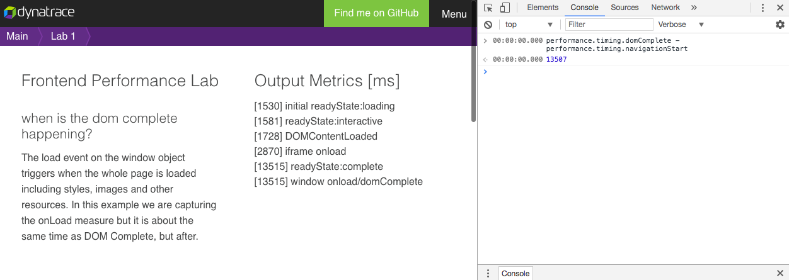
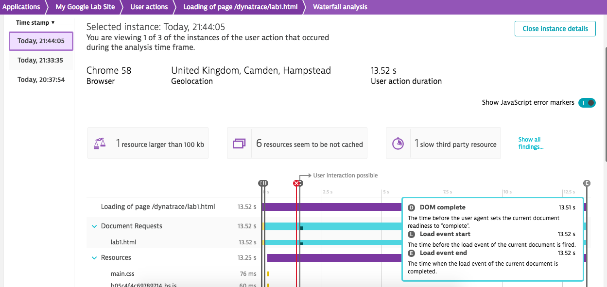
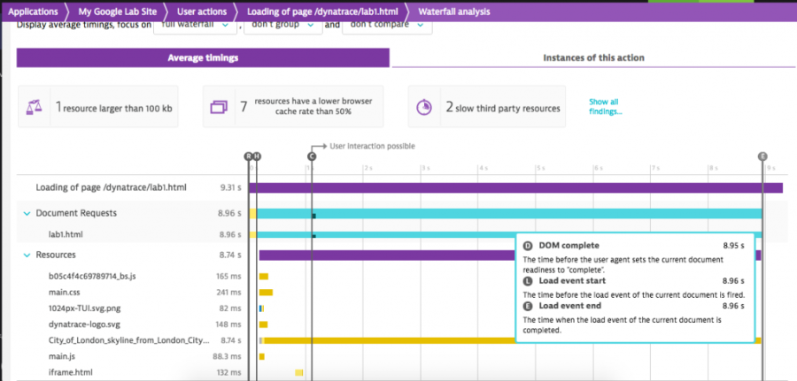

I have been working on a lab I will be delivering at one of my client sites based around W3C Navigation Timings and specifically using the Landmark timings in Dynatrace.

It involves a series of different lab pages reading from the Performance Navigation Timings and demonstrating what can cause a slowdown in those timings in frontend performance.
- [Lab 1: Loading a long image (and trying it again uncached)](https://storage.googleapis.com/dynatrace/lab1.html)
- [Lab 2: Loading third party JavaScripts; and multiple objects from one host (Twitter)](https://storage.googleapis.com/dynatrace/lab2.html)

It actually is a really nice short demo to deliver because in under a few minutes you can go from nothing to a barebone page and just add in the Dynatrace agent tag. You can do this succesfully as a lab since every individual click, user action, transaction is captured.

After setting up the web app (few clicks: create > copy/paste tag > add to site). Perform a refresh of the web page then you have the data.

Workflow I have used:
1. Open application (my google lab site)
2. User actions
3. Loading of page lab1
4. Waterfall analysis (view individual instances of actions – find session)

Of course my lab is based around W3C Navigation Timings with interest of DOM Complete so I focused on that. This actually works just as fine for any of the navigation timings naturally. You will expect the offset in the browser in this case because I am instead of querying performance.timing.* I am actually timing through the onload. This way in case I have a user on an older browser. Dynatrace will take directly from the performance.timing of course (configurable).

And I can view my individual session in Dynatrace and marry up the figure in under just a few minutes I went from deployment to causation. Causation of course demonstrating in this lab the **very** large image.

Of course, you can use average just as well. Do a couple refreshes (try one cached too) and demonstrate the difference caching has on frontend performance there.

I will build more labs into this scenario and update them here accordingly. I am especially interested in demonstrating how adding in items can impact the navigation timings.

