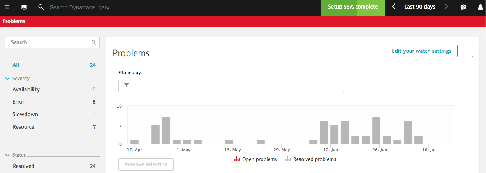
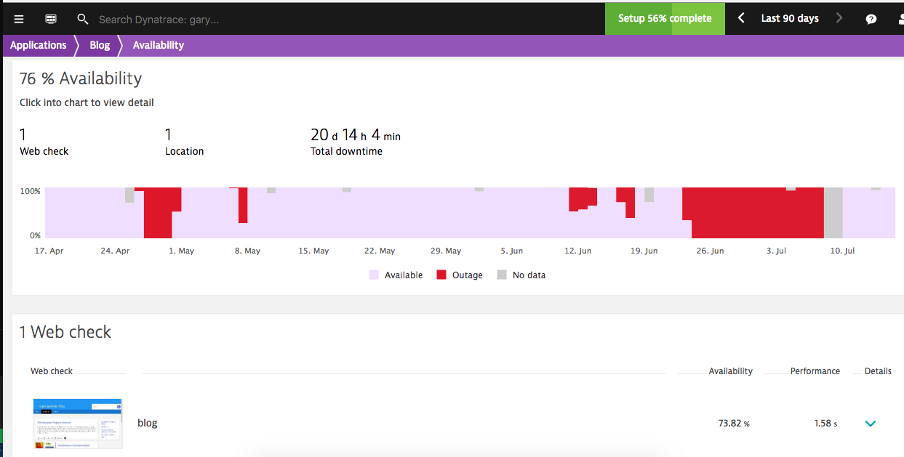
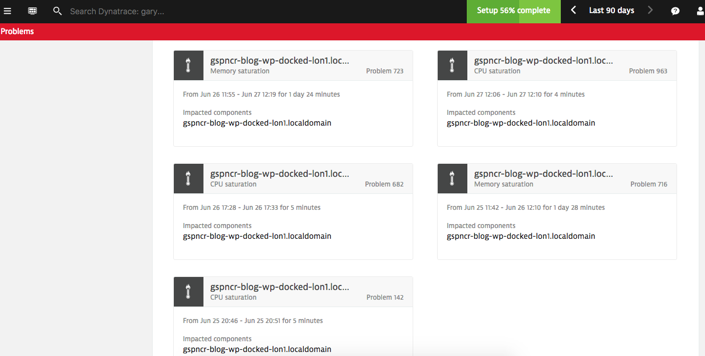
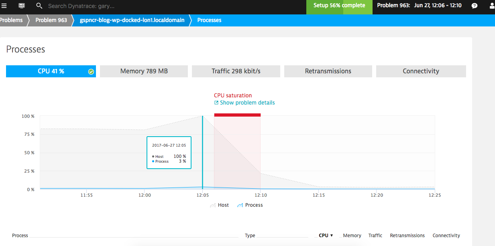

In days gone by when you have utilisation problems in your hosted application you might typically throw more hardware at the problem — delaying the problem. That was in the old age of performance, now APM is more widespread people have looked to solving problems for performance –saving on throwing more hardware at the problem.

In the cloud, and the new stack of technologies, there exists scalability. Typically running smaller hosts, easily destructible and easy to scale new instances. Well, those inefficiencies may still exist – then what, scale up more?

Moreover, the bedrock of your application in a public cloud – you do not know how committed your utilised resources might be. This is a predicament I found myself in with this blog. My stack is a simple one: CentOS hosting docker running Apache, WordPress (PHP) and MySQL; hosted on DigitalOcean with a 1GB Droplet.

**"Why Dockerise something so simple, though?**
Knew you might ask this. Well, actually, it isn’t for performance or DevOps or even to be cool. I wanted to get more exposure to Docker and a blog seemed an ok environment to do it in. My homepage site is hosted in S3 since there’s nothing dynamic about it so does not need any compute (or the overhead of any dynamic language).

Look at all of those problems! For a WordPress blog, this should not be the case!

**What was the problem?**

Saturation. Resources in my host became over utilised. The problem is 2-fold, on the one hand I am running my processes in a docker container, and that docker container is running in a Virtual Machine.

I encountered this problem quite often. In the first days of me dockerising my blog, I did also have phpMyAdmin running too but encountered vast amounts of saturation. It is also worth considering it is not great practice to have so many processes running in one container, I had no failover or swarm plans, and in my case adding docker was just another layer of virtualisation.

I could expand the memory on the instance to solve this. I could set about not using containers. I could consider looking at optimising my running processes.

I *could* do many things.

On the 5th July, I get an email from DO confirming there had been issues on my physical node.

Not bad. I could have acted on this quicker, and – so far – it looks like it was some configuration on my DO node since the saturation has not returned. So far, so good!

In my instance, it actually looks to be my stack may be causing spikes (not huge), where I am causing CPU steal or memory steal. The DO VM will allow me to burst but not hold the burst (fair is fair) and later my processes become saturated.

**Next Steps**

In true NoOps style, it would be worthwhile automating the recycling of my docker instance. This is all very possible with configuration management tools out there, in combination with dynatrace to notify the config manager when there is a problem I can have a totally hands off process for handling this issue!
